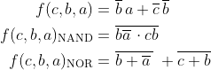
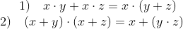
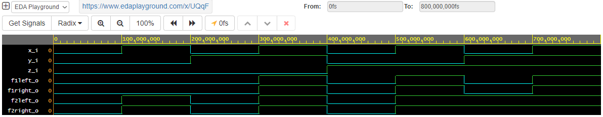

# *Digital-electronics-1.*

## *Labs DE1* 

## *01-gates*

## Task 1. Submit the GitHub link to my Digital-electronics-1 repository

**https://github.com/PetrDvorak221465/Digital-electronics-1**

## Task 2. Verification of De Morgan's laws of function f(c,b,a) 



__Nand and Nor function edited by two De Morgan's laws__

-------------------
-------------------

**Tab to Task 2.**

| **c** | **b** | **a** |
| :-: | :-: | :-: |
| 0 | 0 | 0 |
| 0 | 0 | 1 |
| 0 | 1 | 0 |
| 0 | 1 | 1 |
| 1 | 0 | 0 |
| 1 | 0 | 1 |
| 1 | 1 | 0 |
| 1 | 1 | 1 |


**Code of Task 2.**
```
architecture dataflow of gates is
begin
    f_o     <= ((not b_i) and a_i) or ((not c_i) and (not b_i)) ;
    fnand_o <= (not ((b_i and (not a_i)) and (c_i and b_i)));
    fnor_o  <= (not (b_i or (not a_i))) or (not (c_i or b_i));
    

end architecture dataflow;
```

**Screenshot of waveforms of Task 2.**


**Task 2. Eda Playground https://www.edaplayground.com/x/ZbJM**


## Task 3. Verification of Distributive laws




---------------
---------------

**Tab for Task 3.**

| **z** | **y** | **x** |
| :-: | :-: | :-: |
| 0 | 0 | 0 |
| 0 | 0 | 1 |
| 0 | 1 | 0 |
| 0 | 1 | 1 |
| 1 | 0 | 0 |
| 1 | 0 | 1 |
| 1 | 1 | 0 |
| 1 | 1 | 1 |


**Code of Task 3.**
*Parameters f1 and f2 means first or second distibutive function.*
*Parameters right and left means a part of a function we are working with at the moment.*
```
architecture dataflow of gates is
begin
  
  f1left_o  <= ((x_i and y_i) or (x_i and z_i));
  f1right_o <= (x_i and (y_i or z_i));
  f2left_o  <= (x_i or y_i) and (x_i or z_i);
  f2right_o <= (x_i or (y_i and z_i));
    
end architecture dataflow;
```

**Screenshot of waveforms of Task 3.**



**Task 3. Eda Playground https://www.edaplayground.com/x/UQqF**

