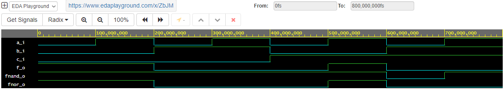

# Digital-electronics-1.

## Labs DE1 

## 01-gates
### Task 2. Verification of De Morgan's laws of function f(c,b,a) 
**Tab to Task 2.**

| **c** | **b** |**a** |
| :-: | :-: | :-: |
| 0 | 0 | 0 |
| 0 | 0 | 1 |
| 0 | 1 | 0 |
| 0 | 1 | 1 |
| 1 | 0 | 0 |
| 1 | 0 | 1 |
| 1 | 1 | 0 |
| 1 | 1 | 1 |


**Code of Task 2.**
```
architecture dataflow of gates is
begin
    f_o     <= ((not b_i) and a_i) or ((not c_i) and (not b_i)) ;
    fnand_o <= (not ((b_i and (not a_i)) and (c_i and b_i)));
    fnor_o  <= (not (b_i or (not a_i))) or (not (c_i or b_i));
    

end architecture dataflow;
```

**Screenshot of waveforms of Task 2.**



**Eda Playground https://www.edaplayground.com/x/ZbJM**
