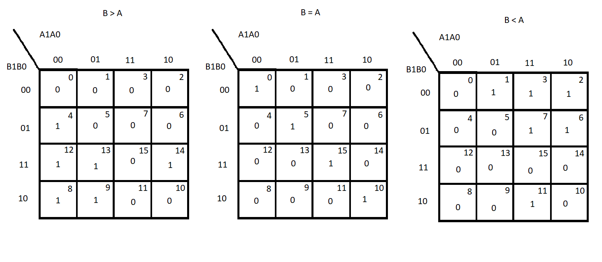
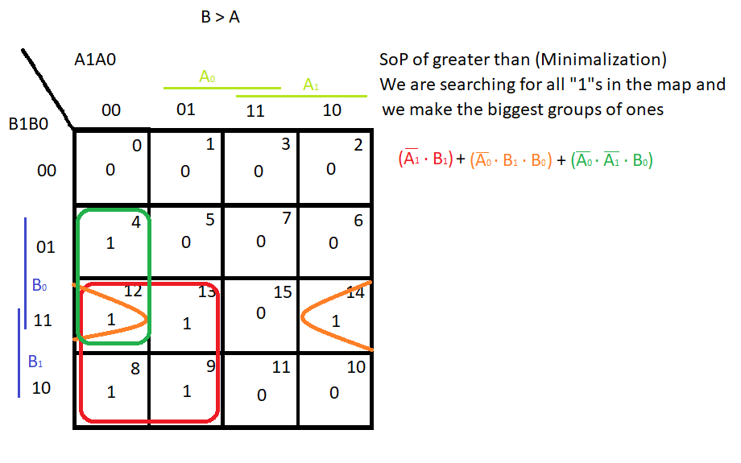
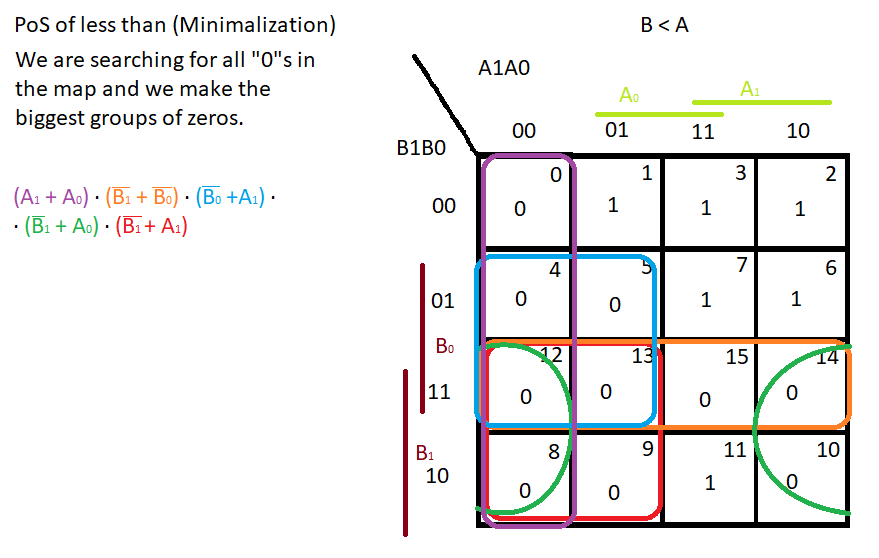

# *Digital-electronics-1*

## *Labs DE1*

## *02-Logic*

## Task 1. Completed 2-bit comparator truth table.

| **Dec. equivalent** | **B[1:0]** | **A[1:0]** | **B is greater than A** | **B equals A** | **B is less than A** |
| :-: | :-: | :-: | :-: | :-: | :-: |
| 0 | 0 0 | 0 0 | 0 | 1 | 0 |
| 1 | 0 0 | 0 1 | 0 | 0 | 1 |
| 2 | 0 0 | 1 0 | 0 | 0 | 1 |
| 3 | 0 0 | 1 1 | 0 | 0 | 1 |
| 4 | 0 1 | 0 0 | 1 | 0 | 0 |
| 5 | 0 1 | 0 1 | 0 | 1 | 0 |
| 6 | 0 1 | 1 0 | 0 | 0 | 1 |
| 7 | 0 1 | 1 1 | 0 | 0 | 1 |
| 8 | 1 0 | 0 0 | 1 | 0 | 0 |
| 9 | 1 0 | 0 1 | 1 | 0 | 0 |
| 10 | 1 0 | 1 0 | 0 | 1 | 0 |
| 11 | 1 0 | 1 1 | 0 | 0 | 1 |
| 12 | 1 1 | 0 0 | 1 | 0 | 0 |
| 13 | 1 1 | 0 1 | 1 | 0 | 0 |
| 14 | 1 1 | 1 0 | 1 | 0 | 0 |
| 15 | 1 1 | 1 1 | 0 | 1 | 0 |


## Task 2. A 2-bit comparator.

### Karnaugh maps for all three functions




--------------

--------------

--------------

--------------

--------------

### Equations of simplified SoP form of the "greater than" function and simplified PoS form of the "less than" function.





Link for example of 2bit comparator Eda Playground : https://www.edaplayground.com/x/JN4t


## Task 3. A 4-bit binary comparator

Listing of VHDL architecture from design file (Code 1.)
Listing of VHDL stimulus process from testbench file (Code 2.)
Listing of simulator console output, i.e. with one reported error (Code 3.)

In All codes is syntax highlighted using asterisks. 

**Code 1.**
```
*architecture* Behavioral of comparator_2bit *is*
*begin*
 
	B_greater_A_o <= '1' when (b_i > a_i) else '0';
	B_equals_A_o  <= '1' when (b_i = a_i) else '0';
    B_less_A_o    <= '1' when (b_i < a_i) else '0';
	
*end architecture* Behavioral;

```

**Code 2.**
```
  --------------------------------------------------------------------
    -- Data generation process
    --------------------------------------------------------------------
    p_stimulus : *process*
    *begin*
        -- Report a note at the begining of stimulus process
        *report* "Stimulus process started" *severity* note;


        -- First test values
        s_b <= "0000"; s_a <= "0000"; wait for 100 ns;
        -- Expected output
        *assert* ((s_B_greater_A = '0') and (s_B_equals_A = '1') and (s_B_less_A = '0'))
        -- If false, then report an error
        *report* "Test failed for input combination: 0000, 0000" *severity* error;
        
        
        s_b <= "0100"; s_a <= "0101"; wait for 100 ns;
     	*assert* ((s_B_greater_A = '0') and (s_B_equals_A = '0') and (s_B_less_A = '1'))
        *report* "Test failed for input combination: 0100, 0101" *severity* error;
        
     	-- Intensional mistake !!!
       	s_b <= "1000"; s_a <= "0011"; wait for 100 ns;
        *assert* ((s_B_greater_A = '0') and (s_B_equals_A = '0') and (s_B_less_A = '1'))
        *report* "Test failed for input combination: 1000, 0011" *severity* error;
     	-- Intensional mistake !!!
     
        s_b <= "1010"; s_a <= "0111"; wait for 100 ns;
        *assert* ((s_B_greater_A = '1') and (s_B_equals_A = '0') and (s_B_less_A = '0'))
        *report* "Test failed for input combination: 1010, 0111" *severity* error;
     
        s_b <= "1111"; s_a <= "0011"; wait for 100 ns;
        *assert* ((s_B_greater_A = '1') and (s_B_equals_A = '0') and (s_B_less_A = '0'))
        *report* "Test failed for input combination: 1111, 0011" *severity* error;
      
        s_b <= "0101"; s_a <= "0101"; wait for 100 ns;
        *assert* ((s_B_greater_A = '0') and (s_B_equals_A = '1') and (s_B_less_A = '0'))
        *report* "Test failed for input combination: 0101, 0101" *severity* error;
    
        s_b <= "0011"; s_a <= "0100"; wait for 100 ns;
        *assert* ((s_B_greater_A = '0') and (s_B_equals_A = '0') and (s_B_less_A = '1'))
        *report* "Test failed for input combination: 0011, 0100" *severity* error;
    
        s_b <= "1001"; s_a <= "1001"; wait for 100 ns;
        *assert* ((s_B_greater_A = '0') and (s_B_equals_A = '1') and (s_B_less_A = '0'))
        *report* "Test failed for input combination: 1001, 1001" *severity* error;
    
        s_b <= "0111"; s_a <= "1011"; wait for 100 ns;
        *assert* ((s_B_greater_A = '0') and (s_B_equals_A = '0') and (s_B_less_A = '1'))
        *report* "Test failed for input combination: 0111, 1011" *severity* error;
    
        s_b <= "1111"; s_a <= "0001"; wait for 100 ns;
        *assert* ((s_B_greater_A = '1') and (s_B_equals_A = '0') and (s_B_less_A = '0'))
        *report* "Test failed for input combination: 1111, 0001" *severity* error;
    
        s_b <= "0011"; s_a <= "0011"; wait for 100 ns;
        *assert* ((s_B_greater_A = '0') and (s_B_equals_A = '1') and (s_B_less_A = '0'))
        *report* "Test failed for input combination: 0011, 0011" *severity* error;
    
        -- Report a note at the end of stimulus process
        *report* "Stimulus process finished" *severity* note;
        wait;
    *end process* p_stimulus;

```

**Code 3.**
```
[2021-02-18 10:57:18 EST] ghdl -i design.vhd testbench.vhd  && ghdl -m  tb_comparator_2bit && ghdl -r  tb_comparator_2bit   --vcd=dump.vcd && sed -i 's/^U/X/g; s/^-/X/g; s/^H/1/g; s/^L/0/g' dump.vcd 
analyze design.vhd
analyze testbench.vhd
elaborate tb_comparator_2bit
testbench.vhd:51:9:@0ms:(report note): Stimulus process started
testbench.vhd:68:9:@300ns:(assertion error): Test failed for input combination: 1000, 0011
testbench.vhd:116:9:@1100ns:(report note): Stimulus process finished
Finding VCD file...
./dump.vcd
[2021-02-18 10:57:19 EST] Opening EPWave...
Done
```

Link to public EDA Playground example : https://www.edaplayground.com/x/dKPq
