# *Digital-electronics-1.*

# *Labs DE1* 

# *03-Vivado*

## <ins>Task 1. Table and schematics with connection of 16 slide switches and 16 LEDs on Nexys A7 board</ins>


| **Switch number** | **Switch pin** | **LED number** | **LED pin** |
| :-: | :-: | :-: | :-: |
| 0 | J15 | 0 | H17 |
| 1 | L16 | 1 | K15 |
| 2 | M13 | 2 | J13 |
| 3 | R15 | 3 | N14 |
| 4 | R17 | 4 | R18 |
| 5 | T18 | 5 | V17 |
| 6 | U18 | 6 | U17 |
| 7 | R13 | 7 | U16 |
| 8 | T8 | 8 | V16 |
| 9 | U8 | 9 | T15 |
| 10 | R16 | 10 | U14 |
| 11 | T13 | 11 | T16 |
| 12 | H6 | 12 | V15 |
| 13 | U12 | 13 | V14 |
| 14 | U11 | 14 | V12 | 
| 15 | V10 | 15 | V11 |

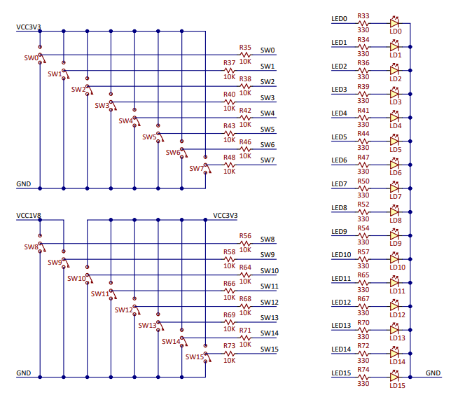


--------------
## <ins>Task 2. Two-bit wide 4-to-1 multiplexer</ins>

### Listing of VHDL architecture from source file mux_2bit_4to1.vhd with syntax highlighting 
```VHDL
architecture Behavioral of mux_2bit_4to1 is
begin
 
	f_o <= a_i when (sel_i = "00") else
	       b_i when (sel_i = "01") else
	       c_i when (sel_i = "10") else
           d_i; 
           
end architecture Behavioral;
```

### Listing of VHDL stimulus process from testbench file tb_mux_2bit_4to1.vhd with syntax highlighting
```VHDL
p_stimulus : process
    begin
        -- Report a note at the begining of stimulus process
        report "Stimulus process started" severity note;

        s_d <= "00"; s_c <= "00"; s_b <= "00"; s_a <= "00";
        s_sel <= "00"; wait for 100 ns;
        
        s_a   <= "01"; wait for 100 ns;
        s_b   <= "01"; wait for 100 ns;
        s_sel <= "01"; wait for 100 ns; 
       
        s_c   <= "01"; wait for 100 ns;
        s_b   <= "11"; wait for 100 ns;
        
        s_d <= "11"; s_c <= "01"; s_b <= "00"; s_a <= "10";
        s_sel <= "10"; wait for 100 ns; 
        
        s_d <= "00"; s_c <= "10"; s_b <= "01"; s_a <= "11";
        s_sel <= "11"; wait for 100 ns;
        
        s_d <= "01"; s_c <= "11"; s_b <= "00"; s_a <= "10";
        s_sel <= "01"; wait for 100 ns;
         
       

        -- Report a note at the end of stimulus process
        report "Stimulus process finished" severity note;
        wait;
    end process p_stimulus;
```

### Screenshot with simulated time waveforms

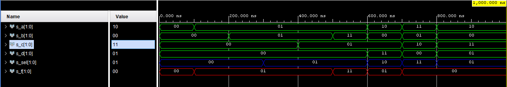


## <ins>Task 3. A Vivado tutorial</ins>

**Welcome to my Vivado tutorial lads!**
Today we will learn about basics of using **Vivado** program made by **Xilinx, Inc.**
This program is made for synthesis and analysis of HDL and today i will show you how to start with Vivado

## Making of new project in Vivado
**1.** After opening Vivado click under **Quick Start** choose **Create Project**.

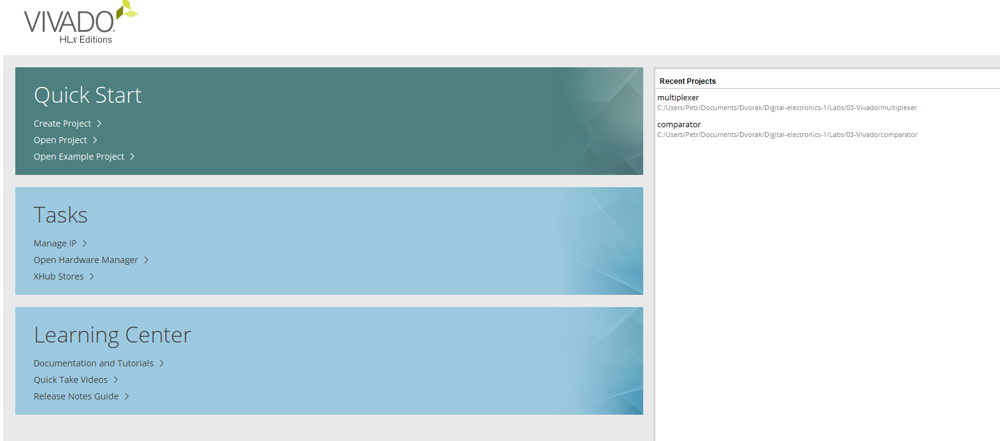

--------------
--------------
--------------
--------------
--------------
--------------
--------------
--------------
--------------
--------------
--------------
--------------

**2.** A wizard open up and on the second window you name your project and location where your project will be saved at.

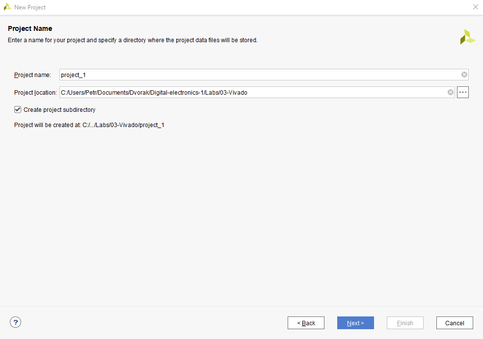

--------------
**3.** After you continue on the third window you choose **RTL Project**.

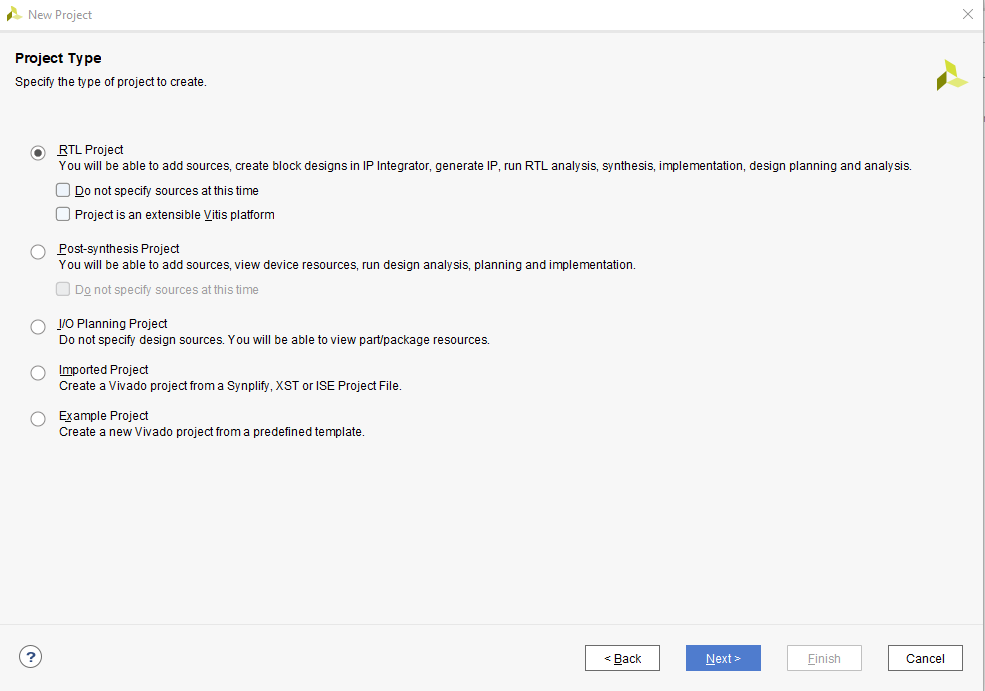

--------------
**4.** Then on the next window program asks you if you want to make a new source file. Either you can do it here by clicking on **Create File** or you can do it later in the project itself.

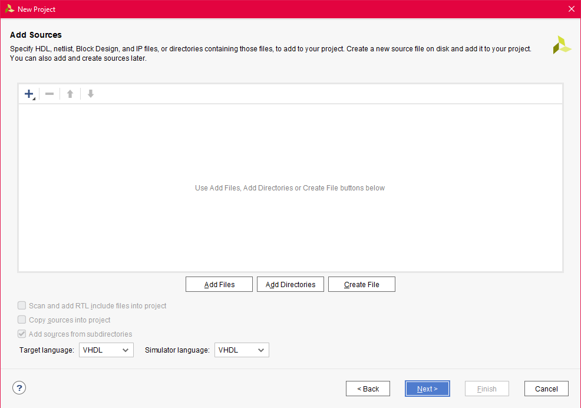

--------------
**5.** Lets suppose you want to create the source now so you click on the **Create File** and small window show up and there you enter the source file name (Lets be honest it is very helpful if you name your sources like the name of your project) and click **OK** and then **Next**.

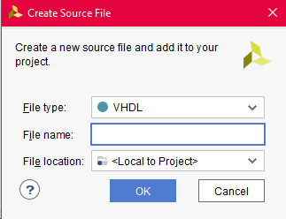

--------------
**6.** The same you can do on the next window but this time for constraints file.

**7.** Then you choose Part or Boards. Lets suppose you choose boards so you click on the item **Boards** and there you choose one of the boards.

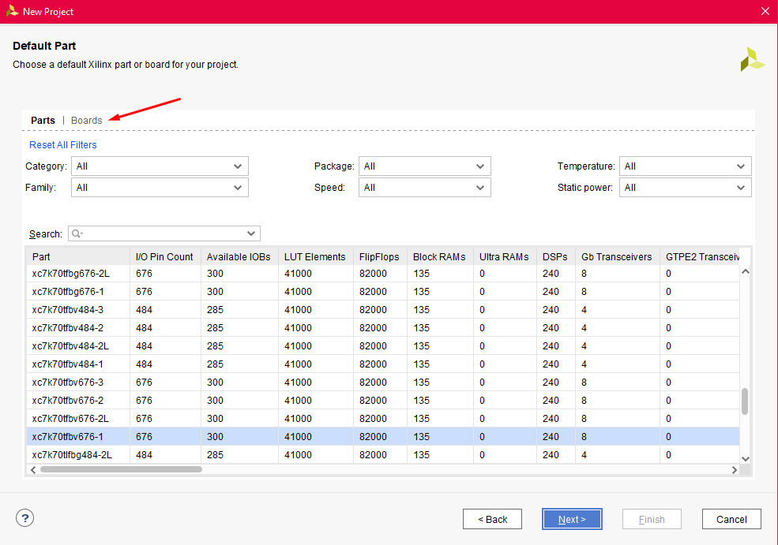

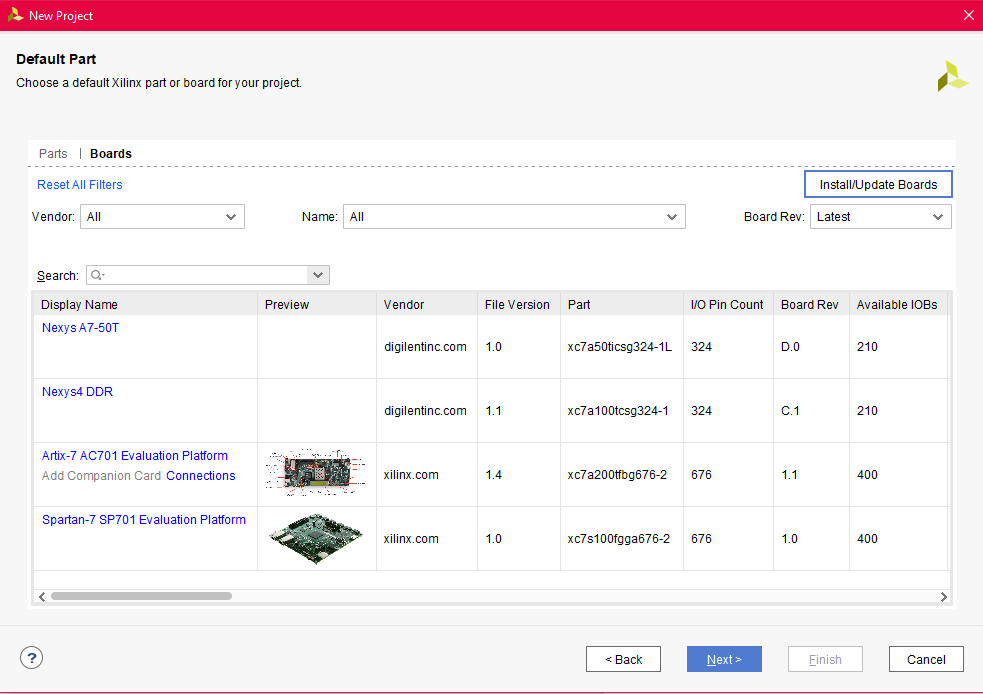

--------------
**8.** Then after clicking **Next** you will see a summary of your project and if you are satisfied with the options you have made you click on **Finish** button.

--------------
## Source files and testbench file
**1.** When your project load up (be patient, it can take a minute) you can add more source files or simulation files by clicking on **File** in the left up corner and then you click on **Add sources**

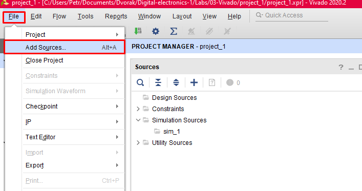

**2.** A window pop up where you can choose if you want design source, simulation source (we call it testbench and its needed to contain conditions for the simulation, so make one of the testbench files) and then constraints file.

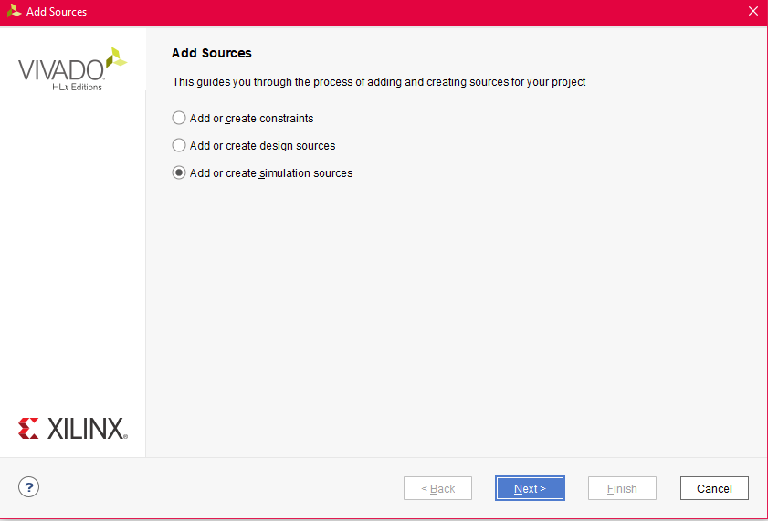

**3.** When we made desigh source and simulation source we can start writing code.

--------------
--------------
## Simulation
**1.** After we are done writing the code in our desigh and testbench files we click the ** Run Simulation** button on the left and we choose **Run .... Simulation** (depends on what we are programming)

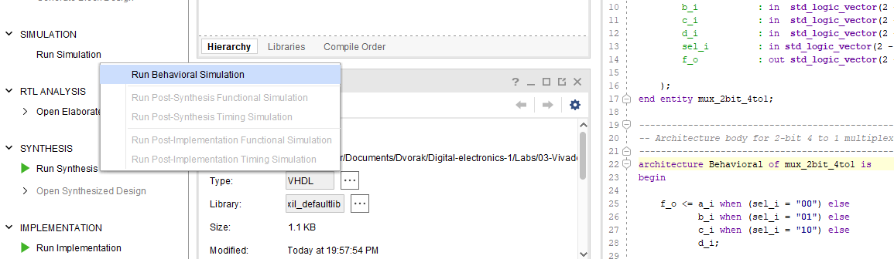

--------------
**2.** The simulation opens and you can see waveforms. If there is some error in the waveforms try to choose other radix

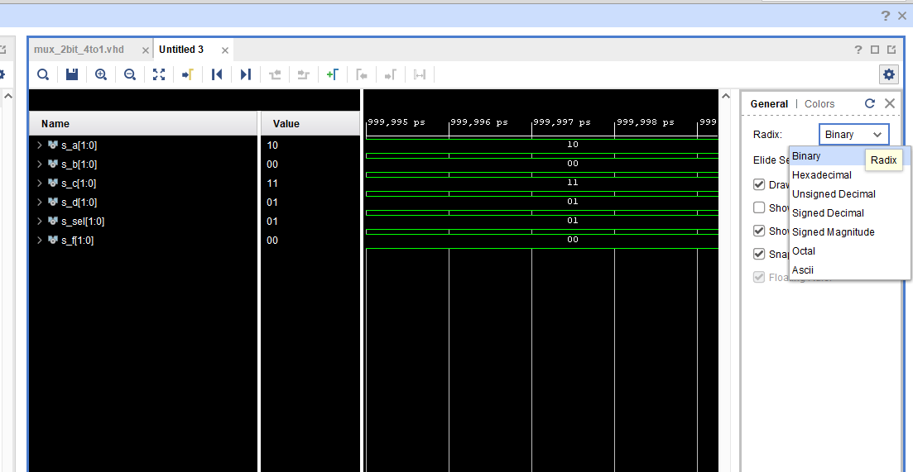

--------------
--------------
--------------
--------------
**3.** Then you can zoom simulation to fit the screen by clicking **Button with four arrows** and you can also change the color of the waves.

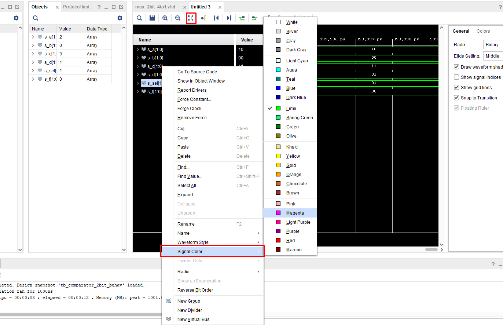

--------------
**4.** For better understanding of the waveforms you can put a cursors on the waves

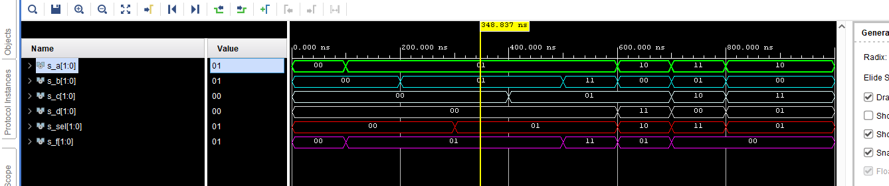

--------------
**Thats all for my simple Vivado tutorial. Have a nice day.**
