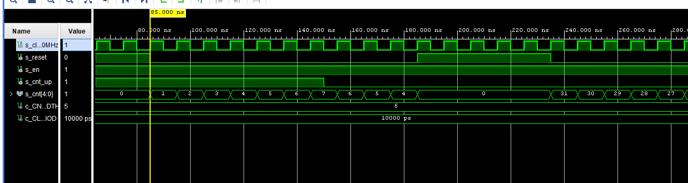
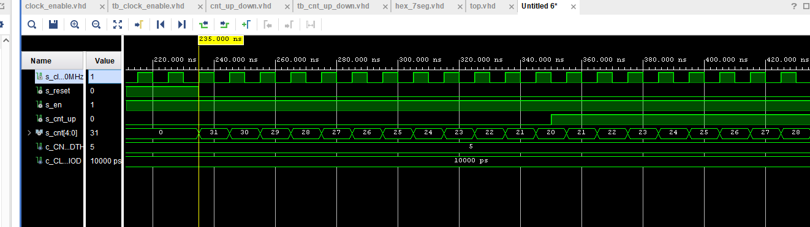
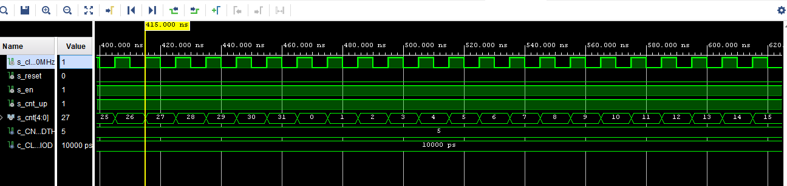
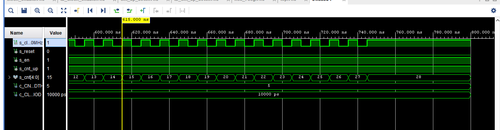
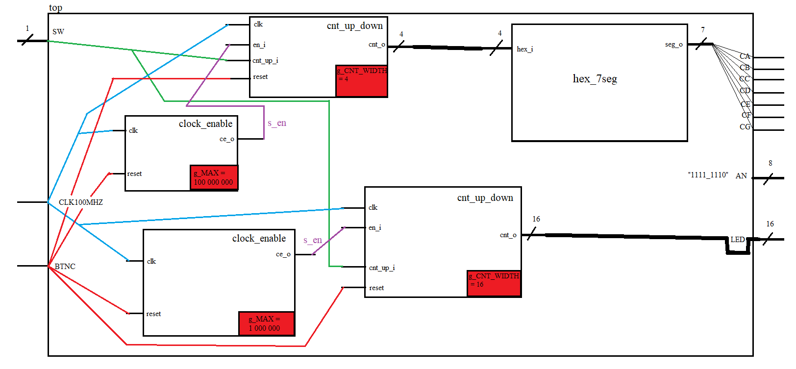

# *Digital-electronics-1.*

# *Labs DE1* 

# *05-counter*
-----------------------------
-----------------------------
-----------------------------
-----------------------------
-----------------------------
-----------------------------
-----------------------------
-----------------------------
-----------------------------
-----------------------------
-----------------------------
-----------------------------
## Task 1. Preparation tasks

### Figure or table with connection of push buttons on Nexys A7 board

| **Push buttons** | **Pin location of the buttons** | **Not pressed(0)** | **Pressed(1)** |
| :-: | :-: | :-: | :-: |
| BTNL | P17 | 0 V | 3,3 V |
| BTNR | M17 | 0 V | 3,3 V |
| BTNU | M18 | 0 V | 3,3 V |
| BTND | P18 | 0 V | 3,3 V |
| BTNC | N17 | 0 V | 3,3 V |


### Table with calculated values.

| **Time interval** | **Number of clk periods** | **Number of clk periods in hex** | **Number of clk periods in binary** |
| :-: | :-: | :-: | :-: |
| 2 ms   |     200 000 |   x"3_0d40" |           b"0011_0000_1101_0100_0000" |
| 4 ms   |     400 000 |   x"6_1A80" |           b"0110_0001_1010_1000_0000" |
| 10 ms  |   1 000 000 |   x"F_4240" |           b"1111_0100_0010_0100_0000" |
| 250 ms |  25 000 000 | x"17D_7840" |      b"1011_1101_0111_1000_0100_0000" |
| 500 ms |  50 000 000 | x"2FA_F080" | b"0001_0111_1010_1111_0000_1000_0000" |
| 1 sec  | 100 000 000 | x"5F5_E100" | b"0101_1111_0101_1110_0001_0000_0000" |
-----------------------------
-----------------------------
## Task 2. Bidirectional counter

### Listing of VHDL code of the process p_cnt_up_down
```VHDL
 p_cnt_up_down : process(clk)
    begin
        if rising_edge(clk) then
         
            if (reset = '1') then               -- Synchronous reset
                s_cnt_local <= (others => '0'); -- Clear all bits

            elsif (en_i = '1') then       -- Test if counter is enabled


                if (cnt_up_i = '1')then
                s_cnt_local <= s_cnt_local + 1;
                
                else
                s_cnt_local <= s_cnt_local - 1;
                end if;

            end if;
        end if;
    end process p_cnt_up_down;
```

### Listing of VHDL reset and stimulus processes from testbench file tb_cnt_up_down.vhd
```VHDL
   ------------------------------------------------------------------
   -- Reset generation process                                       
   ------------------------------------------------------------------
   p_reset_gen : process                                             
   begin                                                             
       s_reset <= '0';                                               
       wait for 12 ns;                                               
                                                                     
       -- Reset activated                                            
       s_reset <= '1';                                               
       wait for 73 ns;                                               
       s_reset <= '0';                                               
                                                                     
       wait for 100 ns;                                              
       s_reset <= '1';                                               
       wait for 50 ns;                                               
       s_reset <= '0';                                               
                                                                     
                                                                     
       wait;                                                         
   end process p_reset_gen;                                          
                                                                     
   ------------------------------------------------------------------
   -- Data generation process                                        
   ------------------------------------------------------------------
   p_stimulus : process                                              
   begin                                                             
       report "Stimulus process started" severity note;              
                                                                     
       -- Enable counting                                            
       s_en     <= '1';                                              
                                                                     
       -- Change counter direction                                   
       s_cnt_up <= '1';                                              
       wait for 150 ns;                                              
       s_cnt_up <= '0';                                              
       wait for 200 ns;                                              
                                                                     
       s_cnt_up <= '1';                                              
       wait for 120 ns;                                              
                                                                     
       wait;                                                         
       -- Disable counting                                           
       s_en     <= '0';                                              
                                                                     
       report "Stimulus process finished" severity note;             
       wait;                                                         
   end process p_stimulus; 
```

### Screenshot with simulated time waveforms; always display all inputs and outputs.


-----------------------------

-----------------------------

-----------------------------

-----------------------------
-----------------------------
## Task 3. 

### Listing of VHDL code from source file top.vhd
```VHDL
----------------------------------------------------
-- Instance of clock_enable entity                  
clk_en0 : entity work.clock_enable                  
    generic map(                                    
        g_MAX => 100000000                          
    )                                               
    port map(                                       
        clk    => CLK100MHZ,                        
        reset  => BTNC,                             
        ce_o   => s_en                              
    );                                              
                                                    
----------------------------------------------------
-- Instance of cnt_up_down entity                   
bin_cnt0 : entity work.cnt_up_down                  
    generic map(                                    
     g_CNT_WIDTH => 4                               
    )                                               
    port map(                                       
      clk       => CLK100MHZ,                       
      reset     => BTNC,                            
      en_i      => s_en,                            
      cnt_up_i  => SW(0),                           
      cnt_o     => s_cnt                            
    );                                              
                                                    
-- Display input value on LEDs                      
LED(3 downto 0) <= s_cnt;                           
                                                    
----------------------------------------------------
-- Instance of hex_7seg entity                      
hex2seg : entity work.hex_7seg                      
    port map(                                       
        hex_i    => s_cnt,                          
        seg_o(6) => CA,                             
        seg_o(5) => CB,                             
        seg_o(4) => CC,                             
        seg_o(3) => CD,                             
        seg_o(2) => CE,                             
        seg_o(1) => CF,                             
        seg_o(0) => CG                              
    );                                              
                                                    
-- Connect one common anode to 3.3V                 
AN <= b"1111_1110";                                 
```

### Image of the top layer including both counters, ie a 4-bit bidirectional counter from Part 4 and a 16-bit counter with a 10 ms time base from Part Experiments on your own.


