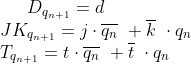
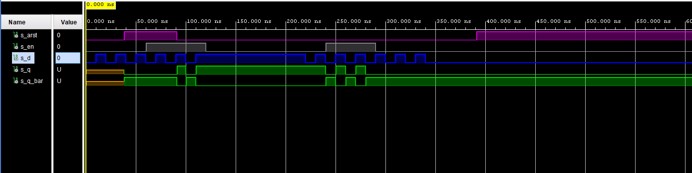
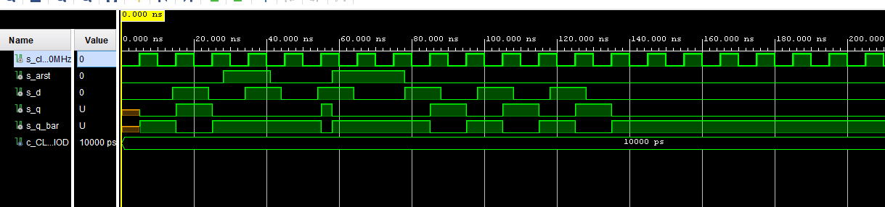
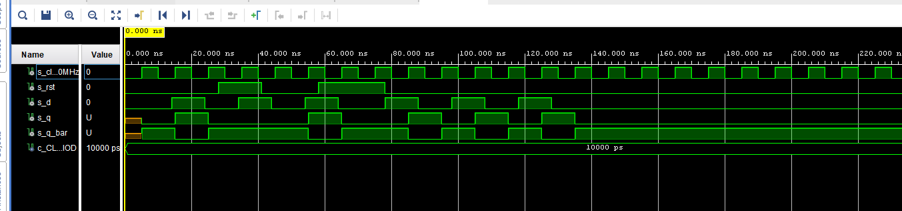
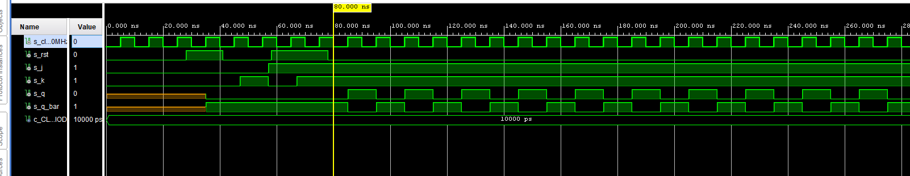
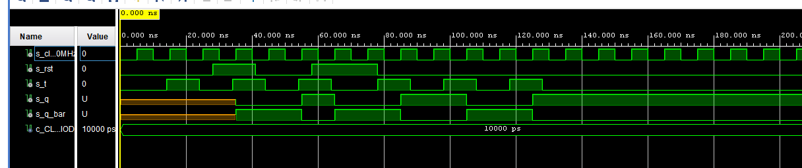
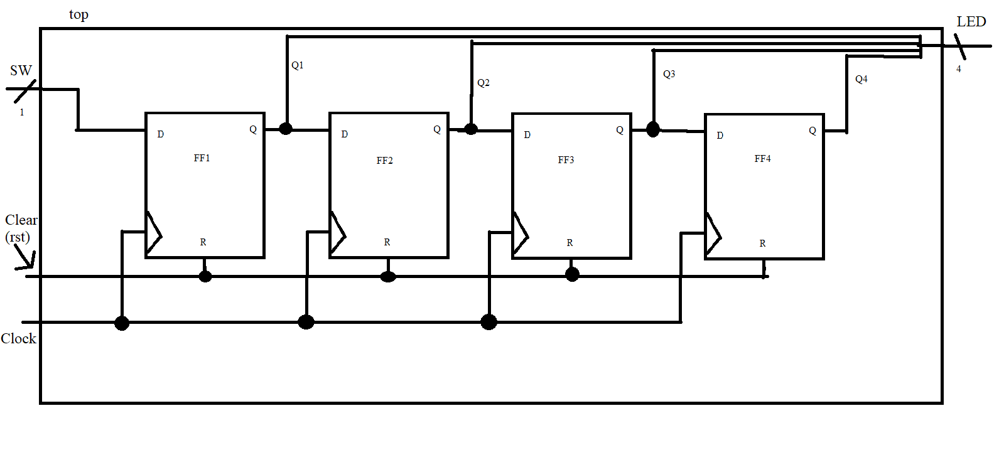

# *Digital-electronics-1.*

# *Labs DE1* 

# *07-ffs*

## Task 1. Preparation tasks 

### Characteristic equations and completed tables for D, JK, T flip-flops.


---------------
---------------
---------------
---------------
---------------
   | **clk** | **d** | **q(n)** | **q(n+1)** | **Comments** |
   | :-: | :-: | :-: | :-: | :-- |
   |  | 0 | 0 | 0 | Signal sampled by rising edge of *clk* |
   |  | 0 | 1 | 0 | Signal sampled by rising edge of *clk*  |
   |  | 1 | 0 | 1 | Signal sampled by rising edge of *clk*  |
   |  | 1 | 1 | 1 | Signal sampled by rising edge of *clk*  |

   | **clk** | **j** | **k** | **q(n)** | **q(n+1)** | **Comments** |
   | :-: | :-: | :-: | :-: | :-: | :-- |
   |  | 0 | 0 | 0 | 0 | No change |
   |  | 0 | 0 | 1 | 1 | No change |
   |  | 0 | 1 | 0 | 0 | Reset |
   |  | 0 | 1 | 1 | 0 | Reset |
   |  | 1 | 0 | 0 | 1 | Set |
   |  | 1 | 0 | 1 | 1 | Set |
   |  | 1 | 1 | 0 | 1 | Toggle |
   |  | 1 | 1 | 1 | 0 | Toggle |

   | **clk** | **t** | **q(n)** | **q(n+1)** | **Comments** |
   | :-: | :-: | :-: | :-: | :-- |
   |  | 0 | 0 | 0 | No change |
   |  | 0 | 1 | 1 | No change |
   |  | 1 | 0 | 1 | Invert (Toggle) |
   |  | 1 | 1 | 0 | Invert (Toggle) |
   
## Task 2. D latch

### VHDL code listing of the process p_d_latch with syntax highlighting
```VHDL
p_d_latch : process(d, arst, en)
    begin
       if (arst = '1') then
           q     <= '0';
           q_bar <= '1';
           
    elsif (en = '1')then
      q     <= d;
      q_bar <= not d; 
          
    end if;
    end process p_d_latch;
```

### Listing of VHDL reset and stimulus processes from the testbench tb_d_latch.vhd file with syntax highlighting and asserts
```VHDL
	--------------------------------------------------------------------
    -- Reset generation process
    --------------------------------------------------------------------
    p_reset_gen : process                                             
   begin                                                             
       s_arst <= '0';                                               
       wait for 38 ns;                                                                                         
       s_arst <= '1';                                               
       wait for 53 ns;                                                                                           
       s_arst <= '0';                                                                                                            
       wait for 300 ns;
        s_arst <= '1';
                                                                      
       wait;                                                         
   end process p_reset_gen;

    --------------------------------------------------------------------
    -- Data generation process
    --------------------------------------------------------------------
    p_stimulus : process                                              
   begin                                                             
       report "Stimulus process started" severity note;              
       s_d <= '0';
       s_en <= '0';
           
       wait for 10 ns; 
       s_d <= '1';
       wait for 10 ns; 
       s_d <= '0'; 
       wait for 10 ns; 
       s_d <= '1'; 
       wait for 10 ns; 
       s_d <= '0'; 
       wait for 10 ns; 
       s_d <= '1'; 
       wait for 10 ns; 
       s_d <= '0'; 
       
       assert(s_q = '0' and s_q_bar = '1')
       report "Haha" severity error;

       s_en <= '1';
       
       wait for 10 ns; 
       s_d <= '1';
       wait for 10 ns; 
       s_d <= '0'; 
       wait for 10 ns; 
       s_d <= '1'; 
       wait for 10 ns; 
       s_d <= '0';
       wait for 10 ns; 
       s_d <= '1';  
       wait for 10 ns; 
       s_en <= '0'; 
       wait for 100 ns; 
       s_d <= '0';
       
       assert(s_q = '1' and s_q_bar = '0')
       report "Haha" severity error; 
       
       wait for 10 ns; 
       s_d <= '1';
       wait for 10 ns; 
       s_d <= '0'; 
       s_en <= '1'; 
       wait for 10 ns; 
       s_d <= '1'; 
       wait for 10 ns; 
       s_d <= '0'; 
       wait for 10 ns; 
       s_d <= '1'; 
       wait for 10 ns; 
       s_d <= '0';
       wait for 10 ns; 
       s_d <= '1';
       s_en <= '0'; 
       wait for 10 ns; 
       s_d <= '0'; 
       wait for 10 ns; 
       s_d <= '1'; 
       wait for 10 ns; 
       s_d <= '0'; 
       wait for 10 ns; 
       s_d <= '1'; 
       wait for 10 ns; 
       s_d <= '0'; 
              
       report "Stimulus process finished" severity note;             
       wait;                                                         
   end process p_stimulus; 
```

### Screenshot with simulated time waveforms; always display all inputs and outputs.


## Task 3. Flip-flops.

### VHDL code listing of the processes p_d_ff_arst
```VHDL
p_d_ff_arst : process(clk, arst)
    begin                           
        if (arst = '1') then         
         q     <= '0';            
         q_bar <= '1';            
                                
        elsif rising_edge(clk) then            
         q     <= d;                   
         q_bar <= not d;               
                                
        end if;                         
    end process p_d_ff_arst;     
```
---------------
---------------
---------------
---------------
### Listing of VHDL clock, reset and stimulus processes p_d_ff_arst
```VHDL
--------------------------------------------------------------------
    -- Clock generation process
    --------------------------------------------------------------------
    p_clk_gen : process
    begin
        while now < 750 ns loop         -- 75 periods of 100MHz clock
            s_clk_100MHz <= '0';
            wait for c_CLK_100MHZ_PERIOD / 2;
            s_clk_100MHz <= '1';
            wait for c_CLK_100MHZ_PERIOD / 2;
        end loop;
        wait;
    end process p_clk_gen;
    --------------------------------------------------------------------
    -- Reset generation process
    --------------------------------------------------------------------
    p_reset_gen : process                                             
   begin                                                             
       s_arst <= '0';                                               
       wait for 28 ns;                                                                                         
       s_arst  <= '1';                                               
       wait for 13 ns;                                                                                           
       s_arst  <= '0'; 
       wait for 17 ns;                                                                                           
       s_arst  <= '1'; 
       wait for 20 ns;                                                                                                            
       s_arst  <= '0';
       wait for 560 ns;
       s_arst  <= '1';
                                                                      
       wait;                                                         
   end process p_reset_gen;
    --------------------------------------------------------------------
    -- Data generation process
    --------------------------------------------------------------------
    p_stimulus : process                                              
   begin                                                             
       report "Stimulus process started" severity note;              
        s_d <= '0';
        wait for 14 ns; 
       s_d <= '1';
       wait for 10 ns; 
       s_d <= '0'; 
       wait for 6 ns;
       
       wait for 4 ns; 
       s_d <= '1'; 
       wait for 10 ns; 
       s_d <= '0';  
       wait for 10 ns; 
       s_d <= '1'; 
       wait for 10 ns; 
       s_d <= '0';
       
       wait for 14 ns; 
       s_d <= '1';
       wait for 10 ns; 
       s_d <= '0'; 
       wait for 10 ns; 
       s_d <= '1'; 
       wait for 10 ns; 
       s_d <= '0'; 
       wait for 10 ns; 
       s_d <= '1'; 
       wait for 10 ns; 
       s_d <= '0'; 
                     
       report "Stimulus process finished" severity note;             
       wait;                                                         
   end process p_stimulus;
```
### Screenshot with simulated time waveforms; always display all inputs and outputs. p_d_ff_arst

### VHDL code listing of the processes p_d_ff_rst
```VHDL
 p_d_ff_rst : process(clk)
    begin                           
        if rising_edge(clk) then  
            if(rst='1') then
                    s_q <= '0';
                else
                    if (d = '0') then
                        s_q <= '0';
                    elsif (d = '1') then
                        s_q <= '1';
                    end if;
                
                end if;           
                                
            end if;                         
    end process p_d_ff_rst;      
```
### Listing of VHDL clock, reset and stimulus processes p_d_ff_rst
```VHDL
 --------------------------------------------------------------------
    -- Clock generation process
    --------------------------------------------------------------------
    p_clk_gen : process
    begin
        while now < 750 ns loop         -- 75 periods of 100MHz clock
            s_clk_100MHz <= '0';
            wait for c_CLK_100MHZ_PERIOD / 2;
            s_clk_100MHz <= '1';
            wait for c_CLK_100MHZ_PERIOD / 2;
        end loop;
        wait;
    end process p_clk_gen;
    
    --------------------------------------------------------------------
    -- Reset generation process
    --------------------------------------------------------------------
    p_reset_gen : process                                             
   begin                                                             
       s_rst <= '0';                                               
       wait for 28 ns;                                                                                         
       s_rst  <= '1';                                               
       wait for 13 ns;                                                                                           
       s_rst  <= '0'; 
       wait for 17 ns;                                                                                           
       s_rst  <= '1'; 
       wait for 20 ns;                                                                                                            
       s_rst  <= '0';
       wait for 560 ns;
       s_rst  <= '1';
                                                                      
       wait;                                                         
   end process p_reset_gen;

    --------------------------------------------------------------------
    -- Data generation process
    --------------------------------------------------------------------
    p_stimulus : process                                              
   begin                                                             
       report "Stimulus process started" severity note;              
        
        s_d <= '0';
        
        wait for 14 ns; 
       s_d <= '1';
       wait for 10 ns; 
       s_d <= '0'; 
       wait for 6 ns;
       
       wait for 4 ns; 
       s_d <= '1'; 
       wait for 10 ns; 
       s_d <= '0';  
       wait for 10 ns; 
       s_d <= '1'; 
       wait for 10 ns; 
       s_d <= '0';
     
       wait for 14 ns; 
       s_d <= '1';
       wait for 10 ns; 
       s_d <= '0'; 
       wait for 10 ns; 
       s_d <= '1'; 
       wait for 10 ns; 
       s_d <= '0'; 
       wait for 10 ns; 
       s_d <= '1'; 
       wait for 10 ns; 
       s_d <= '0'; 
                     
       report "Stimulus process finished" severity note;             
       wait;                                                         
   end process p_stimulus;
```
### Screenshot with simulated time waveforms; always display all inputs and outputs. p_d_ff_rst

### VHDL code listing of the processes p_jk_ff_rst
```VHDL
p_jk_ff_rst : process(clk)
        begin
            if rising_edge(clk) then
                if(rst='1') then
                    s_q <= '0';
                else
                    if (j = '0' and k = '0' ) then
                        s_q <= s_q;
                    elsif (j = '0' and k = '1' ) then
                        s_q <= '0';
                    elsif (j = '1' and k = '0' ) then
                        s_q <= '1';
                    elsif (j = '1' and k = '1' ) then
                        s_q <= not s_q;               
                    
                    end if;
                
                end if;
        
            end if;
          
        end process p_jk_ff_rst;
```
### Listing of VHDL clock, reset and stimulus processes p_jk_ff_rst
```VHDL
--------------------------------------------------------------------
    -- Clock generation process
    --------------------------------------------------------------------
    p_clk_gen : process
    begin
        while now < 750 ns loop         -- 75 periods of 100MHz clock
            s_clk_100MHz <= '0';
            wait for c_CLK_100MHZ_PERIOD / 2;
            s_clk_100MHz <= '1';
            wait for c_CLK_100MHZ_PERIOD / 2;
        end loop;
        wait;
    end process p_clk_gen;
    
      --------------------------------------------------------------------
    -- Reset generation process
    --------------------------------------------------------------------
    p_reset_gen : process                                             
   begin                                                             
       s_rst <= '0';                                               
       wait for 28 ns;                                                                                         
       s_rst  <= '1';                                               
       wait for 13 ns;                                                                                           
       s_rst  <= '0'; 
       wait for 17 ns;                                                                                           
       s_rst  <= '1'; 
       wait for 20 ns;                                                                                                            
       s_rst  <= '0';
       wait for 560 ns;
       s_rst  <= '1';
                                                                      
       wait;                                                         
   end process p_reset_gen;

    --------------------------------------------------------------------
    -- Data generation process
    --------------------------------------------------------------------
    p_stimulus : process                                              
   begin                                                             
       report "Stimulus process started" severity note;              
        
        s_j <= '0';
        s_k <= '0';
        
       wait for 40 ns; 
       s_j <= '0';
       s_k <= '0';
       wait for 7 ns; 
       s_j <= '0';
       s_k <= '1'; 
       wait for 6 ns;
       
       wait for 4 ns; 
       s_j <= '1';
       s_k <= '0'; 
       wait for 10 ns; 
       s_j <= '1';
       s_k <= '1'; 
       
   
       report "Stimulus process finished" severity note;             
       wait;                                                         
   end process p_stimulus;
```
### Screenshot with simulated time waveforms; always display all inputs and outputs. p_jk_ff_rst

### VHDL code listing of the processes p_t_ff_rst
```VHDL
 p_d_ff_rst : process(clk)
    begin                           
        if rising_edge(clk) then  
            if(rst='1') then
                    s_q <= '0';
                else
                    if (t = '0' ) then
                        s_q <= s_q;
                    elsif (t = '1') then
                        s_q <= not s_q;
                                
                    
                    end if;
                    
                end if;           
                                
            end if;                         
    end process p_d_ff_rst;       
```
### Listing of VHDL clock, reset and stimulus processes p_t_ff_rst
```VHDL       
    --------------------------------------------------------------------
    -- Clock generation process
    --------------------------------------------------------------------
    p_clk_gen : process
    begin
        while now < 750 ns loop         -- 75 periods of 100MHz clock
            s_clk_100MHz <= '0';
            wait for c_CLK_100MHZ_PERIOD / 2;
            s_clk_100MHz <= '1';
            wait for c_CLK_100MHZ_PERIOD / 2;
        end loop;
        wait;
    end process p_clk_gen;
    
    --------------------------------------------------------------------
    -- Reset generation process
    --------------------------------------------------------------------
    p_reset_gen : process                                             
   begin                                                             
       s_rst <= '0';                                               
       wait for 28 ns;                                                                                         
       s_rst  <= '1';                                               
       wait for 13 ns;                                                                                           
       s_rst  <= '0'; 
       wait for 17 ns;                                                                                           
       s_rst  <= '1'; 
       wait for 20 ns;                                                                                                            
       s_rst  <= '0';
       wait for 560 ns;
       s_rst  <= '1';
                                                                      
       wait;                                                         
   end process p_reset_gen;

    --------------------------------------------------------------------
    -- Data generation process
    --------------------------------------------------------------------
    p_stimulus : process                                              
   begin                                                             
       report "Stimulus process started" severity note;              
        
        s_t <= '0';
        
        wait for 14 ns; 
       s_t <= '1';
       wait for 10 ns; 
       s_t <= '0'; 
       wait for 6 ns;
       
       wait for 4 ns; 
       s_t <= '1'; 
       wait for 10 ns; 
       s_t <= '0';  
       wait for 10 ns; 
       s_t <= '1'; 
       wait for 10 ns; 
       s_t <= '0';
     
       wait for 14 ns; 
       s_t <= '1';
       wait for 10 ns; 
       s_t <= '0'; 
       wait for 10 ns; 
       s_t <= '1'; 
       wait for 10 ns; 
       s_t <= '0'; 
       wait for 10 ns; 
       s_t <= '1'; 
       wait for 10 ns; 
       s_t <= '0'; 
                     
       report "Stimulus process finished" severity note;             
       wait;                                                         
   end process p_stimulus;
```
### Screenshot with simulated time waveforms; always display all inputs and outputs. p_t_ff_rst


---------------
---------------
---------------
---------------
---------------
---------------
---------------
---------------
---------------
---------------
---------------
## Task 4. Shift register.

### Image of the shift register schematic. 

