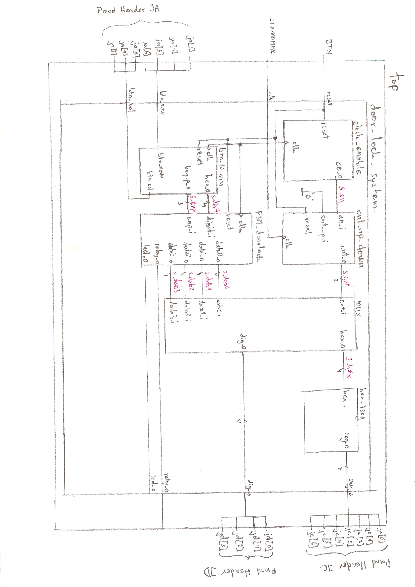
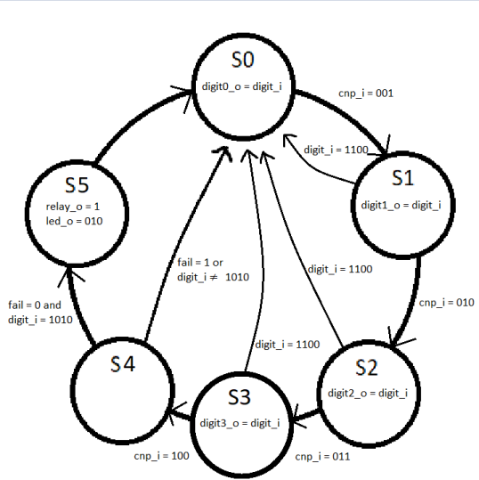
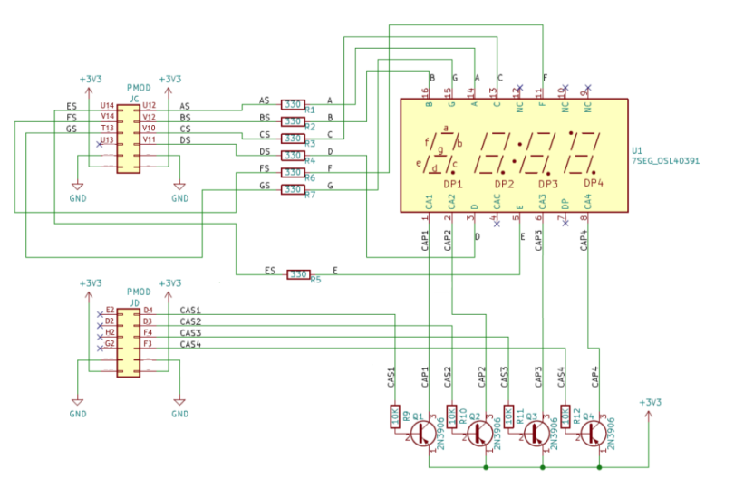
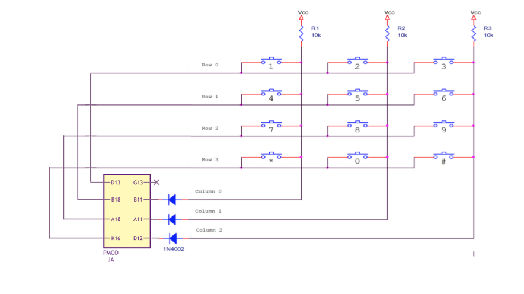
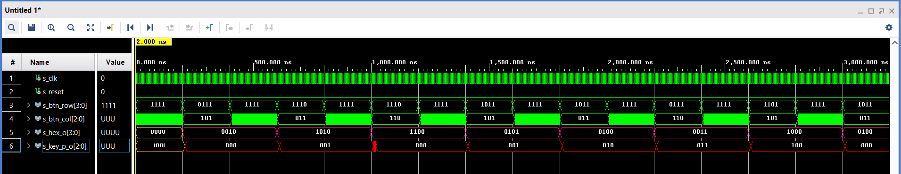
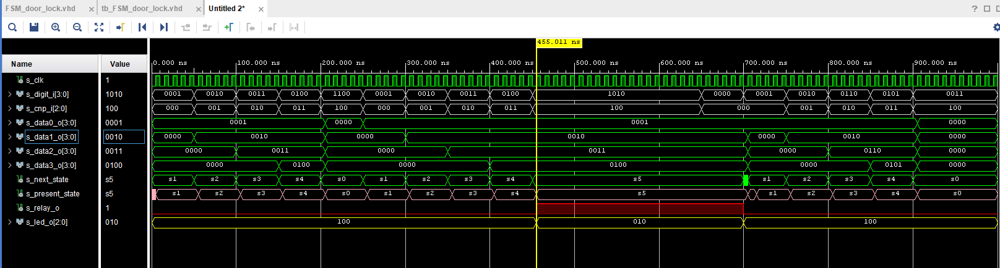
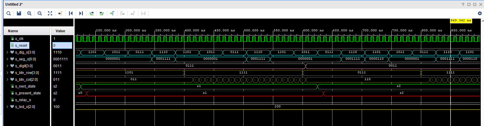
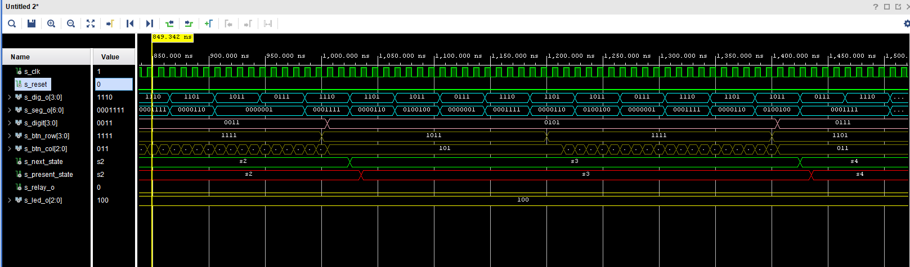

# Terminál pro odemykání dveří pomocí čtyřmístného kódu

### Členové týmu

Klára Heimlichová, Kamil Holub, Petr Dvořák a Ondřej Dočekal

[Odkaz na složku projektu na platformě GitHub]( https://github.com/PetrDvorak221465/Digital-electronics-1/tree/main/Labs/Projekt)

### Cíle projektu

Hlavním cílem projektu bylo vytvořit kód pro desku propojenou s keypadem 4x3, čtyřmi sedmisegmentovými displeji a relé které by 
sloužil jako terminál pro odemykání dveří pomocí čtyřmístného kódu. Naše skupina si dala za úkol vytvořit několik doplňujících funkcí,
a to zrušení  kódu v průběhu zadávání(v praxi například když si uvědomíme, že kód který zkoušíme zadat je chybný), dále funkce tlačítka
které kód potvrdí a pošle, pak také časování zámku aneb časový interval mezi jednotlivými stavy zadávání kódu (po uběhnutí tohoto časového 
intervalu dojde k selhání a vyresetování), a také časování sepnutého relé, které se po několika časových okamžicích po sepnutí rozepne.
Nesmí chybět vizuální signalizace správného zadání kódu, která bude realizována LED diodou.

------------------
------------------
------------------
## Popis hardwaru
Kdybychom nebyly omezení pouze na vytváření kódu, použili bychom extérní klávesnici 4x3, dále desku Arty A7-35T a také extérní čtyři sedmisegmentové displeje.

Funkce extérní klávesnice - Obsahuje matici tlačítek (4 řádky a 3 sloupce). Řádky jsou permanentně na logické "1", zatímco sloupce postupně mění svojí hodnotu 
mezi logickou "0" a "1". Pouze při stlačení tlačítka řádku na sloupci, který je aktuálně v logické "0" se hodnota řádku nastaví na logickou "0".

K vypracování našeho projektu jsme potřebovali tyto moduly: clock enable, count up/down, multiplexer, hex_7seg, btn_to_num, FSM_door_lock
### Popis modulů
**clock enable** - Modul snižující frekvenci vestavěného clocku v desce a tím prodloužuje periodu spuštěného signálu.

**count up/down** - Čítač nahoru a dolů je modul schopný počítat v obou směrech. Pro naše použití postačí čítání jedním směrem. Tento modul je ovládaný modulem 
		clock enable. V multiplexeru mění hodnotu, která pak na čtyř segmentových displejích rozhoduje, který z displejů bude v daný okamžik svítit.

**multiplexer** - Modul spojující hodnotu dat přicházejících z modulu FSM_door_lock s daty přicházejících hodnot z modulu count up/down. Následně jsou tyto data
		poslány k zobrazení.

**hex_7seg** - Je modul sloužící k zobrazení hexadecimálního čísla na sedmisegmentovém displeji, pomocí jednotlivých segmentů.

**btn_to_num** - Entita která je propojená s externím keypadem. Do keypadu se posílá 3 bitové číslo, kde každý bit je připojen na jeden sloupec 
		a postupně nastavuje vždy jeden sloupec na logickou "0" dokud se nestlačí některé z tlačítek, pak je hodnota outputu stála až do puštění tlačítka. 
		Z keypadu příjmá čtyřbitový input z řádků tlačítek kdy pokud není zmáčklé žádné tlačítko, input je roven "1111" jinak je vždy jeden bit roven "0". 
		btn_to_num poté zjišťuje jaká hodnota inputu keypadu nastala při aktuální hodnotě outputu sloupců a přiřadí hodnotu inputu ke čtyřbitovému číslu, 
		který je outputem entity a nese hodnotu zmáčklého tlačítka. Dále zaznamenává pořadí zmáčklého tlačítka a tento stav přiřazuje tříbitovému outputu.
	
**FSM_door_lock** - Tento modul kontroluje správnost kódu. V základu jsou všechny hodnoty nastaveny do nul a následně jsou průchodem stavů,
		přepisovány. Na konci je správný kód potvrzen tlačítkem hvězdičky Pokud dojde k chybnému zadání do funkce fail se zapíše jednička 
		a stav s4 následně vrátí proces do stavu s0. Pokud je zmáčknuto tlačítko křížku, zadávání kódu je předčasně ukončeno a stav je
		vrácen do stavu s0. Zdali je kód zadán a potvrzen správně je na určitou dobu spustěné relé které otevře dveře. K tomu LED dioda,
		která do této doby svítila červeně zezelená. Po uplynutí intervalu se relé zavře a LED dioda se změní zpět na červenou.
		
------------------
------------------
------------------
------------------
------------------
------------------
------------------
------------------
------------------
------------------
------------------
------------------
------------------
------------------
------------------
------------------
------------------
------------------
------------------
------------------
------------------
------------------
------------------
------------------
------------------
------------------
------------------
------------------
------------------
------------------

### Schéma top modulu


### Schéma FSM


------------------
------------------

### Schéma zapojení pinů
Sedmisegmentové displeje

Keypad

Chybějcí zapojení GND a 3V3 je nám známo. Zapoměli jsme na něj. Jedná se však o stejný princip jako 
v zapojení pinů u sedmisegmentových diplejů.
| **RGB LED** | **Pin location of the RGB LED** | **Relay** | **Pin location of relay** |
| :-: | :-: | :-: | :-: |
| led0[2] | E1 | jb | E15 |  
| led0[1] | F6 |  |  |  
| led0[0] | G6 |  |  |  

------------------
------------------
------------------
------------------

## VHDL moduly s popisem, kódem a simulacemi
### VHDL modul btn_to_num
Design file (proces p_read)
```VHDL
   p_read : process(clk) -- process of btn_to_num converting outputs from keypad to 4 bit binary number hex_o
    begin
    if falling_edge(clk) then
            
        case s_cnt_local is -- every case of s_cnt_local will assign 3 bit value to keypad output and then chcecks keypad input
                            -- then it assigns this input to 4 bit output hex_o
        
            when 0 =>
            btn_col <= "011";
                case btn_row is
                    when "0111" =>
                        hex_o <= "0001"; -- 1;
                    when "1011" =>
                        hex_o <= "0100"; -- 4;
                    when "1101" =>
                        hex_o <= "0111"; -- 7;
                    when "1110" =>
                        hex_o <= "1010"; -- 10 = *;
                    when others =>
                end case;
                
            when 1 =>
            btn_col <= "101";
                case btn_row is
                    when "0111" =>
                        hex_o <= "0010"; -- 2;
                    when "1011" =>
                        hex_o <= "0101"; -- 5;
                    when "1101" =>
                        hex_o <= "1000"; -- 8;
                    when "1110" =>
                        hex_o <= "0000"; -- 0 = 0;
                    when others =>
                end case;
                
            when 2 =>
            btn_col <= "110";
                case btn_row is
                    when "0111" =>
                        hex_o <= "0011"; -- 3;
                    when "1011" =>
                        hex_o <= "0110"; -- 6;
                    when "1101" =>
                        hex_o <= "1001"; -- 9;
                    when "1110" =>
                        hex_o <= "1100"; -- 12 = #;
                    when others =>
                        
                end case;
            when others =>
                hex_o <= "0000";
        end case;
        
        case s_key_local is -- assigns the counter of key position to 3 bit output
            when 1 =>
                key_p_o <= "000";
            when 2 =>
                key_p_o <= "001";
            when 3 =>
                key_p_o <= "010";
            when 4 =>
                key_p_o <= "011";
            when 5 =>
                key_p_o <= "100";
            when others =>
        end case;
        
        if(s_cnt_local = 2 and btn_row = "1110") then -- occurs when # is pressed and resets the key position counter
             s_key_local <= 1;
        end if;
        
        if (btn_row /= "1111") then -- occurs when key is pressed
            if(pressed = '0') then -- ensures that code will run only once after pressing key
                pressed <= '1';
                if(s_key_local >= 5) then -- resets key position counter
                    s_key_local <= 1;
                else
                    s_key_local <= s_key_local + 1;
                end if;
            end if;
        else -- when no key is pressed
            pressed <= '0'; -- resets the key pressed value for next time key is pressed
            if (reset = '1' or s_cnt_local >= 2) then  -- counting from 0 to 2 for the btn_col output
                s_cnt_local <= 0;
            else
                s_cnt_local <= s_cnt_local + 1;
            end if;
        end if;  
             
    end if;
    end process p_read;
```

------------------
------------------
------------------
------------------
------------------
------------------


Testbench file (Clk generation proces a stimulus proces)
```VHDL
   p_clk_gen : process -- clock period generation process
    begin
        while now < 4200 ns loop
            s_clk <= '0';
            wait for c_CLK_100MHZ_PERIOD / 2;
            s_clk <= '1';
            wait for c_CLK_100MHZ_PERIOD / 2;
        end loop;
        wait;
    end process p_clk_gen;
               
    p_stimulus : process
    begin
        report "Stimulus process started" severity note; -- data generation process
        s_btn_row <= "1111";
        wait for 200 ns;
      
        s_btn_row <= "0111";
        wait for 200 ns;
        
        s_btn_row <= "1111";
        wait for 200 ns;
        
        s_btn_row <= "1110";
        wait for 200 ns;
        
        s_btn_row <= "1111";
        wait for 200 ns;
        
        s_btn_row <= "1110";
        wait for 200 ns;
        
        s_btn_row <= "1111";
        wait for 200 ns;
        
        s_btn_row <= "1011";
        wait for 200 ns;
        
        s_btn_row <= "1111";
        wait for 200 ns;
        
        s_btn_row <= "1011";
        wait for 200 ns;
        
        s_btn_row <= "1111";
        wait for 200 ns;
      
        s_btn_row <= "0111";
        wait for 200 ns;
        
        s_btn_row <= "1111";
        wait for 200 ns;
        
        s_btn_row <= "1101";
        wait for 200 ns;
        
        s_btn_row <= "1111";
        wait for 200 ns;
        
        s_btn_row <= "1011";
        wait for 200 ns;
        
        s_btn_row <= "1111";
        wait for 200 ns;
        
        s_btn_row <= "1011";
        wait for 200 ns;
        
        s_btn_row <= "1111";
        wait for 200 ns;
        
        s_btn_row <= "1011";
        wait for 200 ns;
        
        s_btn_row <= "1111";
        wait for 200 ns;
        
        s_btn_row <= "0111";
        wait for 200 ns;
        
        s_btn_row <= "1111";
        wait for 200 ns;
        
        s_btn_row <= "1101";
        wait for 200 ns;
        
        s_btn_row <= "1111";
        wait for 200 ns;
        
        s_btn_row <= "1011";
        wait for 200 ns;
        
        s_btn_row <= "1111";
        wait for 200 ns;
        
        s_btn_row <= "1011";
        wait for 200 ns;
        
        s_btn_row <= "1111";
        wait for 200 ns;
        
        report "Stimulus process finished" severity note;
        wait;
    end process p_stimulus;
```

Simulace


### VHDL modul FSM_door_lock *dls*
Design file (proces p_code_check)
```VHDL
   p_code_check : process(s_present_state, digit_i)
    begin
        case s_present_state is     -- Case for present states, values are reseted to zero,
            when s0 =>              -- case is counting from state s0 to state s5 (if the inputs are correct).
            fail <= '0';            -- If the input/s is/are wrong the fail is set to 1 and the process is 
            data0_o <= "0000";      -- in the case s4 reseted. 
            data1_o <= "0000";      -- The values from each state are writen in data0_o, data1_o, data2_o and data4_o.
            data2_o <= "0000";      -- If the # button is pressed process resets prematurely. 
            data3_o <= "0000";      -- If the inputs are all correct the relay opens and the LED changes its,
            relay_o <= '0';         -- color from red to green for a several moments
            led_o <= "100";
                if  (cnp_i = "000")then
                
                    if  digit_i = "1100" then
                        s_next_state <= s0;
                    end if;    
                    if  digit_i /= "0001" then
                        fail <= '1';
                    end if;
                    data0_o <= digit_i;
                    s_next_state <= s1;
                end if;
            
            
            when s1 =>
                if  (cnp_i = "001")then
                    if (s_cnt < c_delay) then
                      s_cnt <= s_cnt + 1;
                    else
                      s_cnt <= c_zero;
                      s_next_state <= s0;
                    end if;
                    
                    if  digit_i = "1100" then
                        s_next_state <= s0;
                    end if;   
                  
                    if  digit_i /= "0010" then
                      fail <= '1';
                    end if;
                    data1_o <= digit_i;
                    s_next_state <= s2;     
                end if;
            
            
            
            when s2 =>
                if  (cnp_i = "010")then
                     s_cnt <= c_zero;
                     if (s_cnt < c_delay) then
                         s_cnt <= s_cnt + 1;
                     else
                         s_next_state <= s0;
                     end if;
                     
                     if  digit_i = "1100" then
                        s_next_state <= s0;
                     end if;   
                     
                     if  digit_i /= "0011" then
                         fail <= '1';
                     end if;
                     data2_o <= digit_i;
                     s_next_state <= s3;
                end if;
            
            
            
            when s3 =>
                if  (cnp_i = "011")then
                   s_cnt <= c_zero;
                   if (s_cnt < c_delay) then
                       s_cnt <= s_cnt + 1;
                   else
                       s_next_state <= s0;
                   end if;
                   
                   if  digit_i = "1100" then
                        s_next_state <= s0;
                   end if;   
                   
                   if  digit_i /= "0100" then
                       fail <= '1';
                   end if;
                   data3_o <= digit_i;
                   s_next_state <= s4;
                end if;
            
            
            
            when s4 =>
                if  (cnp_i = "100")then
                    if (s_cnt < c_delay) then     
                        s_cnt <= s_cnt + 1;            
                    else                               
                        s_next_state <= s0;            
                    end if; 
                    
                    if  digit_i = "1100" then
                        s_next_state <= s0;
                    end if;                              

                    if (digit_i = "1010" and fail = '0') then -- Confirming the code with *
                       s_next_state <= s5;
                    else
                    s_next_state <= s0;
                       
                    end if;
                    
                end if;
                
            when s5 =>
                    relay_o <= '1';
                    led_o <= "010";
                    s_cnt <= c_zero;
                 if (s_cnt < c_delay) then
                           s_cnt <= s_cnt + 1;
                 else
                     relay_o <= '0';
                     led_o <= "100";
                     s_cnt <= c_zero;
                     s_next_state <= s0;
                 end if;   
             
             when others =>
               s_next_state <= s0;
               
        end case;
    end process p_code_check;
```

------------------
------------------
------------------
------------------
------------------
------------------
------------------
------------------
------------------
------------------
------------------
------------------


Testbench file (Clk generation proces a stimulus proces)
```VHDL
   --Clock generation process--  
    p_clk_gen : process
       begin
           while now < 1000 ns loop
               s_clk <= '0';
               wait for c_CLK_100MHZ_PERIOD / 2;
               s_clk <= '1';
               wait for c_CLK_100MHZ_PERIOD / 2;
           end loop;
           wait;
       end process p_clk_gen;
                  
    p_reset_gen : process
        begin
            s_arst <= '0';
           
    
            wait;
        end process p_reset_gen;
   
   --Data generation process--    
    p_stimulus : process         
    begin
        report "Stimulus process started" severity note;
        
        s_cnp_i <= "000";   
        s_digit_i <= "0001";
        wait for 50 ns;   
        s_cnp_i <= "001";     
        s_digit_i <= "0010";  
        wait for 50 ns;                  
        s_cnp_i <= "010";     
        s_digit_i <= "0011";  
        wait for 50 ns;
        s_cnp_i <= "011";     
        s_digit_i <= "0100";  
        wait for 50 ns;               
        s_cnp_i <= "100";     
        s_digit_i <= "1100";
        wait for 50 ns;

        s_cnp_i <= "000";
        s_digit_i <= "0001";
        wait for 50 ns;
        s_cnp_i <= "001";   
        s_digit_i <= "0010";
        wait for 50 ns;
        s_cnp_i <= "010";       
        s_digit_i <= "0011";
        wait for 50 ns;    
        s_cnp_i <= "011";   
        s_digit_i <= "0100";
        wait for 50 ns;   
        s_cnp_i <= "100";   
        s_digit_i <= "1010";
        wait for 200 ns;    

        s_cnp_i <= "000";
        s_digit_i <= "0000";
        wait for 50 ns;  
        s_cnp_i <= "000";
        s_digit_i <= "0001";
        wait for 50 ns;
        s_cnp_i <= "001";   
        s_digit_i <= "0010";
        wait for 50 ns;
        s_cnp_i <= "010";       
        s_digit_i <= "0110";
        wait for 50 ns;    
        s_cnp_i <= "011";   
        s_digit_i <= "0101";
        wait for 50 ns;    
  
        s_cnp_i <= "100";   
        s_digit_i <= "0011";
        wait for 50 ns;    
        
        report "Stimulus process finished" severity note;
        wait;
    end process p_stimulus;
```

Simulace


Ostatní z našich modulů byly již byly otestovány a odsimulovány a to ve čtvrtém cvičení (hex_7seg), v pátém cvičení (clock enable, count up/down) a pak v šestém cvičení (multiplexer).
Odkazy na soubory s testovanými kódy jsou přiloženy v referencích.

------------------
------------------
------------------
------------------
------------------
------------------

## TOP modul s popisem, kódem a simulací

### door_lock_system (Top modul)
Design file
```VHDL
  architecture Behavioral of door_lock_system is

    signal s_en    : std_logic;                           -- Internal clock enable
    signal s_cnt   : std_logic_vector(2 - 1 downto 0);    -- Internal 2-bit counter for multiplexing 4 digits
    signal s_hex   : std_logic_vector(4 - 1 downto 0);    -- Internal 4-bit value for 7-segment decoder
    signal s_digit : std_logic_vector(4 - 1 downto 0);    -- Internal 4-bit value number for FSM_doorlock
    signal s_cnp   : std_logic_vector(3 - 1 downto 0);    -- Internal 3-bit position of the input value
    signal s_data0 : std_logic_vector(4 - 1 downto 0);    -- Internal 4-bit values for multiplexer
    signal s_data1 : std_logic_vector(4 - 1 downto 0);
    signal s_data2 : std_logic_vector(4 - 1 downto 0);
    signal s_data3 : std_logic_vector(4 - 1 downto 0);

    begin
    --------------------------------------------------------------------
    -- Instance of clock_enable entity that generates an enable pulse
    clk_en0 : entity work.clock_enable
        generic map(
            g_MAX => 4
        )
        port map(
            clk   => clk,
            reset => reset,
            ce_o  => s_en
        );

    --------------------------------------------------------------------
    -- Instance of cnt_up_down entity performs a 2-bit counter
    bin_cnt0 : entity work.cnt_up_down
        generic map(
            g_CNT_WIDTH => 2
        )
        port map(
            clk      => clk,
            reset    => reset,
            en_i     => s_en,
            cnt_up_i => cnt_up_i,
            cnt_o    => s_cnt
        );

    --------------------------------------------------------------------
    -- Instance of hex_7seg entity performs a 7-segment display decoder
    hex2seg : entity work.hex_7seg
        port map(
            hex_i => s_hex,
            seg_o => seg_o
        );
        
    --------------------------------------------------------------------
    -- Instance of mux entity performs a 4-to-1 multiplexer
    mux_4to1 : entity work.mux
        port map(
            cnt_i   => s_cnt,
            data0_i => s_data0,
            data1_i => s_data1,
            data2_i => s_data2,
            data3_i => s_data3,
            hex_o   => s_hex,
            dig_o   => dig_o
        );
    

    btn_to_num : entity work.btn_to_num
        port map(
            clk     => clk,    
            reset   => reset,  
            btn_row => btn_row,
            btn_col => btn_col,
            hex_o   => s_digit,
            key_p_o => s_cnp
        );
        
    dls : entity work.dls
        port map(
                clk     => clk,    
                arst    => reset,   
                digit_i => s_digit,
                cnp_i   => s_cnp,  
                relay_o => relay_o,
                data0_o => s_data0,
                data1_o => s_data1,  
                data2_o => s_data2,  
                data3_o => s_data3,  
                led_o   => led_o
            
        );   
 end Behavioral;
```

Testbench file (Clk generation a stimulus proces)
```VHDL
	p_clk_gen : process -- clock period generation process
    begin
        while now < 4200 ns loop
            s_clk <= '0';
            wait for c_CLK_100MHZ_PERIOD / 2;
            s_clk <= '1';
            wait for c_CLK_100MHZ_PERIOD / 2;
        end loop;
        wait;
    end process p_clk_gen;
    
	p_reset_gen : process
      begin
          s_reset <= '1';
          wait for 20 ns;
          s_reset <= '0'; 
    
          wait;
      end process p_reset_gen;
   

	p_stimulus : process
    begin
        report "Stimulus process started" severity note; -- data generation process
        s_btn_row <= "1111";
        wait for 200 ns;
      
        s_btn_row <= "1101";
        wait for 200 ns;
        
        s_btn_row <= "1111";
        wait for 200 ns;
        
        s_btn_row <= "0111";
        wait for 200 ns;
        
        s_btn_row <= "1111";
        wait for 200 ns;
        
        s_btn_row <= "1011";
        wait for 200 ns;
        
        s_btn_row <= "1111";
        wait for 200 ns;
        
        s_btn_row <= "1101";
        wait for 200 ns;
        
        s_btn_row <= "1111";
        wait for 200 ns;
        
        s_btn_row <= "1101";
        wait for 200 ns;
        
        s_btn_row <= "1111";
        wait for 200 ns;
      
        s_btn_row <= "1101";
        wait for 200 ns;
        
        s_btn_row <= "1111";
        wait for 200 ns;
        
        s_btn_row <= "0111";
        wait for 200 ns;
        
        s_btn_row <= "1111";
        wait for 200 ns;
        
        s_btn_row <= "1011";
        wait for 200 ns;
        
        s_btn_row <= "1111";
        wait for 200 ns;
        
        s_btn_row <= "1101";
        wait for 200 ns;
        
        s_btn_row <= "1111";
        wait for 200 ns;
        
        s_btn_row <= "1101";
        wait for 200 ns;
        report "Stimulus process finished" severity note;
        wait;
    end process p_stimulus;
```

Simulace



## Video

[Odkaz na video]( https://youtu.be/ef6zOv8_AHA )


## Reference

1. Testování a simulace pro modul hex_7seg - 
[Odkaz na modul hex_7seg na platformě GitHub](https://github.com/PetrDvorak221465/Digital-electronics-1/blob/main/Labs/04-segment/README.md )
	
2. Testování a simulace pro modul clock enable + count up/down - 
[Odkaz na modul clock_enable a count up/down na platformě GitHub](https://github.com/PetrDvorak221465/Digital-electronics-1/blob/main/Labs/05-counter/README.md)
	
3. Testování a simulace pro modul multiplexer - 
[Odkaz na modul multiplexer na platformě GitHub](https://github.com/PetrDvorak221465/Digital-electronics-1/blob/main/Labs/06-display_driver/README.md)

4. Informace o desce Arty A7-35T se kterou jsme pracovali - 
[Odkaz reference manual desky Arty A7-35T](https://reference.digilentinc.com/reference/programmable-logic/arty-a7/reference-manual)

[Odkaz na schémata desky Arty A7-35T](https://reference.digilentinc.com/_media/reference/programmable-logic/arty-a7/arty_a7_sch.pdf)

